# CloudNav-abcd 项目文档

## 变更记录 (Changelog)

### 2026-01-11
- 初始化架构师扫描完成
- 生成根级和模块级文档
- 建立项目知识库索引

---

## 项目愿景

CloudNav-abcd 是一个基于原项目 [sese972010/CloudNav](https://github.com/sese972010/CloudNav-) 的个性化修改版本。这是一个**现代化的智能私有导航站**，完全基于 **Cloudflare Pages + KV** 构建，无需服务器，永久免费使用。

**核心特性**：
- 基于密码的访问控制，适合个人隐私管理
- AI 深度集成（支持 Google Gemini、OpenAI、DeepSeek、Claude 等）
- 多端数据实时同步（Cloudflare KV + WebDAV 双重备份）
- 拖拽排序、置顶专区、分类目录锁
- Chrome 扩展插件支持
- 完美适配桌面端和移动端

---

## 架构总览

### 技术栈
- **前端框架**: React 19.2.0 + TypeScript 5.8.2
- **UI 框架**: Tailwind CSS（通过 CDN 引入）
- **构建工具**: Vite 6.2.0
- **拖拽排序**: @dnd-kit/core + @dnd-kit/sortable
- **AI 集成**: @google/genai 1.30.0
- **图标库**: lucide-react 0.554.0
- **后端**: Cloudflare Pages Functions（Serverless）
- **数据库**: Cloudflare KV（键值存储）
- **备份**: WebDAV 协议支持

### 架构特点
1. **前后端分离**: 前端通过 Vite 构建，后端为 Cloudflare Functions API
2. **状态管理**: 基于 React Hooks 的本地状态 + LocalStorage 缓存
3. **数据同步**: 三层架构（内存状态 -> LocalStorage -> Cloudflare KV）
4. **边缘计算**: 利用 Cloudflare 全球 CDN 实现低延迟访问

---

## 模块结构图

```mermaid
graph TD
    A["(根) CloudNav-abcd"] --> B["components/"];
    A --> C["services/"];
    A --> D["functions/"];
    A --> E["根文件"];

    B --> B1["AuthModal.tsx<br/>CategoryAuthModal.tsx<br/>CategoryActionAuthModal.tsx"];
    B --> B2["LinkModal.tsx<br/>CategoryManagerModal.tsx"];
    B --> B3["BackupModal.tsx<br/>ImportModal.tsx<br/>SettingsModal.tsx"];
    B --> B4["SearchConfigModal.tsx<br/>QRCodeModal.tsx<br/>ContextMenu.tsx"];
    B --> B5["Icon.tsx<br/>IconSelector.tsx"];

    C --> C1["geminiService.ts<br/>(AI 描述生成)"];
    C --> C2["webDavService.ts<br/>(WebDAV 备份)"];
    C --> C3["bookmarkParser.ts<br/>(书签导入解析)"];
    C --> C4["exportService.ts<br/>(数据导出)"];

    D --> D1["api/storage.ts<br/>(KV 数据存储)"];
    D --> D2["api/link.ts<br/>(链接操作)"];
    D --> D3["api/webdav.ts<br/>(WebDAV 代理)"];

    E --> E1["App.tsx<br/>(主应用组件)"];
    E --> E2["types.ts<br/>(类型定义)"];
    E --> E3["index.tsx<br/>(入口)"];
    E --> E4["vite.config.ts<br/>(构建配置)"];

    style B fill:#e1f5ff
    style C fill:#fff4e6
    style D fill:#f3e5f5
    style E fill:#e8f5e9
```



---

## 模块索引

| 模块路径 | 职责概述 | 关键文件 |
|---------|---------|---------|
| [/components](./components/CLAUDE.md) | React 组件库：模态框、认证、设置、搜索配置等 | AuthModal.tsx, LinkModal.tsx, SettingsModal.tsx |
| [/services](./services/CLAUDE.md) | 业务逻辑服务：AI、WebDAV、书签解析、导出 | geminiService.ts, webDavService.ts, bookmarkParser.ts |
| [/functions](./functions/CLAUDE.md) | Cloudflare 无服务器 API：数据存储、链接操作、WebDAV 代理 | api/storage.ts, api/link.ts, api/webdav.ts |
| [/](./CLAUDE.md) | 根文件：入口、类型定义、配置 | App.tsx, types.ts, index.tsx, vite.config.ts |

---

## 运行与开发

### 环境要求
- Node.js 16.x 或更高版本
- npm 或 pnpm

### 开发命令
```bash
# 安装依赖
npm install

# 启动开发服务器（运行在 http://localhost:3000）
npm run dev

# 生产构建
npm run build

# 预览构建产物
npm run preview
```

### 部署到 Cloudflare Pages
1. Fork 本项目到你的 GitHub
2. 在 Cloudflare Dashboard 创建 Pages 应用，连接 GitHub 仓库
3. 构建配置：
   - 框架预设: **无 (None)**
   - 构建命令: `npm run build`
   - 输出目录: `dist`
4. 创建 KV 命名空间 `CLOUDNAV_DB`
5. 绑定 KV：
   - 变量名: `CLOUDNAV_KV`
   - 值: 选择创建的 `CLOUDNAV_DB`
6. 设置环境变量 `PASSWORD`（访问密码）
7. 重新部署

详细部署教程请参考 [README.md](/Users/yml/codes/CloudNav-abcd/README.md) 或项目内的 `图文教程.docx`。

---

## 测试策略

**当前状态**：项目未包含自动化测试文件。

**建议测试方向**：
1. **单元测试**：
   - `services/` 下的 AI、WebDAV、书签解析逻辑
   - `types.ts` 中的数据结构验证
2. **集成测试**：
   - Cloudflare Functions API 的端到端测试
   - KV 数据读写一致性测试
3. **E2E 测试**：
   - 登录流程、链接增删改查
   - 拖拽排序、分类管理
   - 备份恢复功能

推荐工具：Vitest（单元测试）+ Playwright（E2E 测试）

---

## 编码规范

### TypeScript
- 所有组件和服务必须有明确的类型定义
- 使用 `types.ts` 中定义的接口，避免重复声明
- 优先使用函数式组件和 React Hooks

### React 组件
- 组件文件名使用 PascalCase（如 `LinkModal.tsx`）
- 优先使用受控组件模式
- 避免在 JSX 中编写复杂逻辑，抽取到独立函数

### 代码风格
- 缩进: 2 空格
- 引号: 单引号
- 分号: 推荐使用
- 遵循 ESLint 和 Prettier 规范（如已配置）

### Cloudflare Functions
- API 路由文件命名：小写字母 + 连字符（如 `storage.ts`）
- 必须导出 `onRequestGet`、`onRequestPost` 等标准方法
- 统一使用 CORS 头部 `corsHeaders`

---

## AI 使用指引

### 可询问的问题类型
1. **功能开发**：
   - "如何为链接卡片添加标签功能？"
   - "如何实现链接的批量编辑？"
   - "如何增加新的 AI 服务提供商？"

2. **问题排查**：
   - "为什么 WebDAV 备份失败？"
   - "Cloudflare KV 数据未同步的原因？"
   - "拖拽排序后数据丢失如何解决？"

3. **代码优化**：
   - "如何减少 App.tsx 的复杂度？"
   - "如何优化链接图标的加载性能？"
   - "如何改进搜索功能的响应速度？"

4. **部署与配置**：
   - "如何在 Cloudflare Pages 上配置自定义域名？"
   - "如何设置密码过期时间？"
   - "如何更换 AI 服务的 API Key？"

### 关键上下文文件
- 数据结构定义：`/Users/yml/codes/CloudNav-abcd/types.ts`
- 主应用逻辑：`/Users/yml/codes/CloudNav-abcd/App.tsx`
- API 层：`/Users/yml/codes/CloudNav-abcd/functions/api/storage.ts`
- AI 服务：`/Users/yml/codes/CloudNav-abcd/services/geminiService.ts`
- WebDAV 服务：`/Users/yml/codes/CloudNav-abcd/services/webDavService.ts`

### AI 能力边界
- **可以协助**：功能开发、代码审查、问题排查、文档生成
- **无法直接操作**：Cloudflare 控制台配置、第三方 API 密钥申请、生产环境部署

---

## 相关文件清单

### 配置文件
- `/Users/yml/codes/CloudNav-abcd/package.json` - 依赖和脚本定义
- `/Users/yml/codes/CloudNav-abcd/tsconfig.json` - TypeScript 编译配置
- `/Users/yml/codes/CloudNav-abcd/vite.config.ts` - Vite 构建配置
- `/Users/yml/codes/CloudNav-abcd/.gitignore` - Git 忽略规则

### 核心源码
- `/Users/yml/codes/CloudNav-abcd/index.html` - HTML 入口
- `/Users/yml/codes/CloudNav-abcd/index.tsx` - React 应用挂载
- `/Users/yml/codes/CloudNav-abcd/App.tsx` - 主应用组件（2640 行）
- `/Users/yml/codes/CloudNav-abcd/types.ts` - TypeScript 类型定义

### 文档
- `/Users/yml/codes/CloudNav-abcd/README.md` - 项目说明
- `/Users/yml/codes/CloudNav-abcd/LICENSE` - MIT 开源协议
- `/Users/yml/codes/CloudNav-abcd/图文教程.docx` - 部署图文教程

---

## 项目健康度

### 优势
- ✅ 清晰的模块划分（components / services / functions）
- ✅ TypeScript 类型覆盖完整
- ✅ 无服务器架构，运维成本低
- ✅ 多端数据同步机制完善

### 待改进
- ⚠️ 缺少自动化测试
- ⚠️ `App.tsx` 文件过大（2640 行），建议拆分
- ⚠️ 部分组件缺少 PropTypes 或接口文档注释
- ⚠️ 错误处理和日志记录可以增强

---

## 快速问题排查

### 常见问题
1. **登录失败**：检查 Cloudflare 环境变量 `PASSWORD` 是否设置
2. **数据未同步**：检查 KV 命名空间绑定是否正确（变量名必须为 `CLOUDNAV_KV`）
3. **AI 描述生成失败**：验证 API Key 是否有效，检查网络连接
4. **WebDAV 备份失败**：确认 WebDAV 服务地址和凭证正确，检查 CORS 策略

### 调试技巧
- 打开浏览器开发者工具 Network 面板，查看 API 请求状态
- 检查 Cloudflare Pages 的实时日志（Functions 标签页）
- 查看浏览器 Console 错误信息
- 使用 `localStorage.getItem('cloudnav_data_cache')` 查看本地缓存数据

---

**最后更新时间**: 2026-01-11
**文档版本**: v1.0
**项目版本**: v1.7
